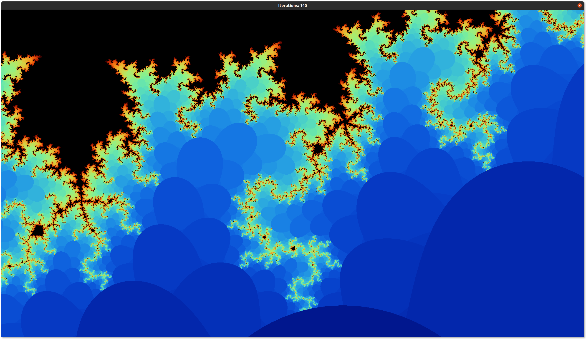
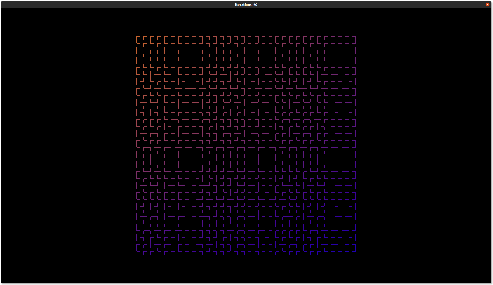
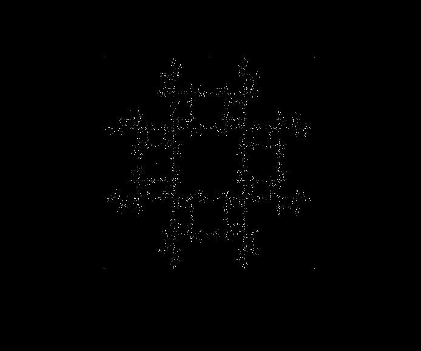

## Information

**FP-Fraktal** ist ein interaktives Tool zur Darstellung und Berechnung von Fraktalen in Echtzeit. Dazu werden die SDL2 und OpenGL Bibliotheken verwendet.

## Voraussetzungen

Voraussetzungen ist eine funktionierende Haskell-Installation und eine Grafikkarte bzw. einen Treiber für diese Grafikkarte, der die OpenGL-Version 4 unterstützt.

## Build

1. cabal installieren
2. `cabal install` ausführen

## Bedienung

Das Programm lässt sich mit `cabal run` ausführen.

**Wahl des Fraktals:**

* F1: Mandelbrot
* F2: Julia-Menge
* F3: Sierpinski-Teppich
* F4: Koch-Schneeflocke
* F5: Sierpinski-Dreieck
* F6: Hilbertkurve
* 1: Sierpinski-Dreieck (Chaos game)
* 2: "Teppich" (Chaos game)
* 3: "Teppich 2" (Chaos game)

**Steuerung:**

* Mausrad oder I und K: Zoom verändern
* WASD: Bewegung der Ansicht
* O und L: Anzahl der Iterationen verändern

## Fraktale

Wir unterstützen drei Arten von Fraktalen.

**Escape-time Fraktale (Mandelbrot und Julia-Menge).** Die Berechnung erfolgt indem jedem Pixel einem Punkt innerhalb der Menge zugewiesen wird. Für jeden dieser Punkte wird dann der "Farbwert" berechnet, indem die unendliche Zahlfolge solange durchlaufen wird, bis der Betrag den "Escape-Wert" überschreitet oder alle Iterationen durchlaufen sind.

Da Haskell etwas zu langsam wäre um diese Berechnung in Echtzeit durchzuführen, setzen wir stattdessen auf einen GLSL-Shader. Dies sind kleine Programme die direkt auf der Grafikkarte laufen.

**Iterated Function Systems (IFS) und Finite Subdivision.** Die Fraktale werden anhand von Regeln gebildet, z.B. das Aufteilen einer geometrischen Figur in sich selber und in gleichartige kleinere Figuren (Sierpinski-Teppich).

**"Chaos game" Fraktale oder auch "Attraktor".** Hier entsteht ein Fraktal in dem für einen beliebigen Startpunkt eine zufällige Folge gebildet wird. Je nachdem welche Sequenz und welche Eckpunkte gewählt wurden, konvergiert diese Folge eventuell in ein Fraktal. Diese Berechnung ist sehr rechenintensiv, da erst nach mehreren Tausend Iterationen ein erkennbares Bild entsteht.

